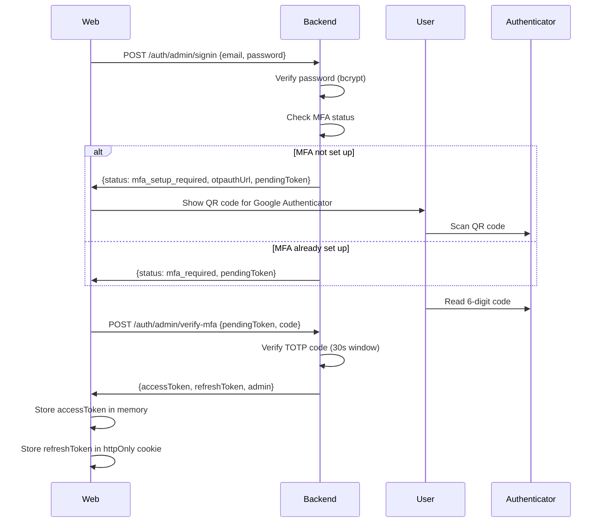
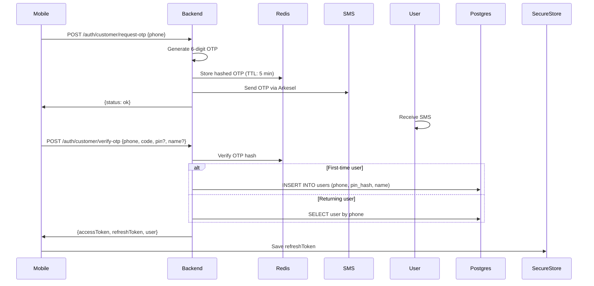

# FraudShield Architecture

**Last Updated:** June 5, 2026  
**Version:** 1.0.0  
**Sprint:** 12

---

## Table of Contents

1. [System Overview](#1-system-overview)
2. [Component Architecture](#2-component-architecture)
3. [Data Flow](#3-data-flow)
4. [Security Model](#4-security-model)
5. [Deployment Architecture](#5-deployment-architecture)
6. [Technology Stack](#6-technology-stack)
7. [Database Schema](#7-database-schema)
8. [API Design](#8-api-design)
9. [Authentication Flow](#9-authentication-flow)
10. [Risk Scoring Engine](#10-risk-scoring-engine)
11. [Blockchain Audit Trail](#11-blockchain-audit-trail)
12. [Scaling Considerations](#12-scaling-considerations)

---

## 1. System Overview

FraudShield is a **composite security platform** that combines three defensive layers to detect and prevent fraud in Ghana's mobile money ecosystem:

1. **AI Risk Scoring** — Rule-based engine that analyzes transaction patterns in real-time
2. **Blockchain Audit Trail** — Immutable, tamper-evident ledger of all security events
3. **Multi-Factor Authentication** — Password + TOTP (admins) / Phone + OTP + PIN (customers)

### High-Level Architecture

```
┌─────────────────┐     HTTPS      ┌──────────────────┐
│  Web Dashboard  │◄───────────────►│                  │
│   (React SPA)   │                 │   Backend API    │
└─────────────────┘                 │ (Node.js/Express)│
                                    │                  │
┌─────────────────┐     HTTPS      │  ┌────────────┐  │
│   Mobile App    │◄───────────────┤  │ PostgreSQL │  │
│ (React Native)  │                 │  └────────────┘  │
└─────────────────┘                 │  ┌────────────┐  │
                                    │  │   Redis    │  │
                                    │  └────────────┘  │
                                    └──────────────────┘
```

---

## 2. Component Architecture

### 2.1 Backend API (Node.js/Express)

**Location:** `backend/`

```
backend/
├── src/
│   ├── server.js              # Entry point, starts HTTP server
│   ├── app.js                 # Express app with middleware chain
│   ├── routes/                # API endpoints (auth, transactions, etc.)
│   ├── services/              # Business logic (risk scoring, blockchain)
│   ├── middleware/            # Cross-cutting concerns (auth, rate limiting)
│   ├── db/                    # Database connection, migrations, seeds
│   └── jobs/                  # Background tasks (blockchain verifier)
└── tests/                     # Integration tests with Supertest
```

**Responsibilities:**
- Authenticate users and admins
- Process transactions
- Calculate AI risk scores
- Maintain blockchain audit trail
- Serve real-time SSE feed
- Enforce rate limits and security policies

### 2.2 Web Admin Dashboard (React + Vite)

**Location:** `src/`

```
src/
├── pages/                     # Route-level components
│   ├── Dashboard.jsx          # KPI summary
│   ├── LiveTransactions.jsx   # Real-time transaction feed
│   ├── RiskAnalytics.jsx      # Charts and trend analysis
│   └── ...
├── components/                # Reusable UI (Sidebar, ErrorBoundary)
├── api/                       # HTTP client with auto-refresh
├── context/                   # React Context (AuthContext)
├── hooks/                     # Custom hooks (useApi)
└── utils/                     # Pure functions (logger, async helpers)
```

**Responsibilities:**
- Display fraud analytics in real-time
- Allow admins to review and resolve alerts
- Provide AI configuration interface
- Show blockchain verification status

### 2.3 Mobile Customer App (React Native + Expo)

**Location:** `mobile/`

```
mobile/
├── src/
│   ├── screens/               # Auth and main app screens
│   │   ├── auth/              # SignIn, OTP, PIN, Biometric
│   │   └── main/              # Home, SendMoney, Transactions
│   ├── navigation/            # Stack and tab navigators
│   ├── api/                   # HTTP client (similar to web)
│   ├── context/               # AuthContext for mobile
│   └── utils/                 # Fraud scenario simulator
└── app.json                   # Expo configuration
```

**Responsibilities:**
- Customer authentication (phone + OTP + PIN + biometric)
- Send money with AI risk preview
- Transaction history with blockchain hashes
- Educational fraud scenario walkthroughs

---

## 3. Data Flow

### 3.1 Transaction Creation Flow

```
1. Customer opens mobile app
2. Enters recipient phone + amount
3. Mobile calls POST /api/transactions/preview
4. Backend runs risk scorer → returns score + reasons
5. Mobile shows AI verdict to customer
6. Customer confirms
7. Mobile calls POST /api/transactions
8. Backend:
   a. Validates input with Zod
   b. Checks sender balance
   c. Runs risk scorer again
   d. If safe/review: deducts balance, credits recipient
   e. If blocked: transaction saved but no money moved
   f. Appends to blockchain ledger
   g. Publishes SSE event
9. Returns transaction with blockchain hash
10. Mobile shows confirmation + hash
11. Web dashboard sees new transaction appear live
```

### 3.2 Real-Time Update Flow (SSE)

```
Web Dashboard                Backend                     Event Bus
      │                         │                            │
      ├──GET /api/events/stream─►│                            │
      │◄─────────────────────────┤ (connection held open)    │
      │                         │                            │
      │                         │◄──transaction.new event───┤
      │◄─────event: data────────┤                            │
      │  {id, amount, status}   │                            │
      │                         │                            │
      │  (DOM updates instantly)│                            │
```

---

## 4. Security Model

### 4.1 Authentication Layers

**Admins (Web Dashboard):**
1. Email + bcrypt-hashed password (cost 12)
2. TOTP (Google Authenticator) — 6-digit code, 30-second window
3. JWT access token (15-minute expiry, in-memory storage)
4. Refresh token (7-day expiry, httpOnly cookie)

**Customers (Mobile App):**
1. Phone number + SMS OTP (5-minute expiry)
2. 4-digit PIN (bcrypt-hashed, cost 12)
3. Optional biometric (fingerprint/Face ID, device-local only)
4. JWT access token (15-minute expiry, in-memory)
5. Refresh token (7-day expiry, expo-secure-store)

### 4.2 Authorization Model

```
Role Hierarchy:
┌──────────────┐
│ super_admin  │ ← Full access (can manage admins)
├──────────────┤
│ supervisor   │ ← Can resolve alerts, configure AI
├──────────────┤
│ analyst      │ ← Read-only dashboard access
└──────────────┘

Customer         ← Can only see own transactions
```

**Enforcement:**
- Middleware: `authenticate()` → `requireAdmin()` → `requireRole(...)`
- Every protected route checks JWT claims
- Frontend also checks role (UX optimization, not security boundary)

### 4.3 Rate Limiting

| Endpoint | Limit | Window | Purpose |
|----------|-------|--------|---------|
| Admin signin | 5 attempts | 15 min | Prevent brute force |
| Customer OTP | 3 requests | 10 min | Prevent SMS spam |
| Transaction preview | 10 requests | 1 min | Prevent API abuse |

**Implementation:** Redis-backed counters with TTL

---

## 5. Deployment Architecture

### Production (Railway + Vercel + EAS)

```
┌─────────────────────────────────────────────────────┐
│                    Internet                         │
└───────────────┬─────────────────┬───────────────────┘
                │                 │
        ┌───────▼──────┐  ┌──────▼────────┐
        │   Vercel     │  │    Railway    │
        │ (Web Static) │  │  (Backend)    │
        │              │  │               │
        │ fraud-shield │  │ ┌───────────┐ │
        │ .vercel.app  │  │ │ Node.js   │ │
        └──────────────┘  │ │ Express   │ │
                          │ └───────────┘ │
        ┌──────────────┐  │ ┌───────────┐ │
        │   Expo EAS   │  │ │PostgreSQL │ │
        │ (APK Build)  │  │ │   16-alpine│ │
        │              │  │ └───────────┘ │
        │ Download URL │  │ ┌───────────┐ │
        └──────────────┘  │ │   Redis   │ │
                          │ │  7-alpine │ │
                          │ └───────────┘ │
                          └───────────────┘
```

**Resource Allocation:**
- Backend: 0.5 vCPU, 512 MB RAM
- PostgreSQL: 0.25 vCPU, 256 MB RAM
- Redis: 0.25 vCPU, 256 MB RAM

**Cost:** ~$5-7/month (within Railway Hobby plan)

### Local Development

```
┌────────────────────────────────────────────┐
│          Developer Laptop                  │
├────────────────────────────────────────────┤
│  Web (localhost:5173)  ← Vite dev server  │
│  Backend (localhost:3000) ← nodemon       │
│  Mobile (Expo Go app) ← Metro bundler     │
│                                            │
│  Docker Desktop:                           │
│  ├─ PostgreSQL (localhost:5432)           │
│  └─ Redis (localhost:6379)                │
└────────────────────────────────────────────┘
```

---

## 6. Technology Stack

### Backend
- **Runtime:** Node.js 20 LTS
- **Framework:** Express 5
- **Database:** PostgreSQL 16
- **Cache/Queue:** Redis 7
- **Validation:** Zod 4
- **Testing:** Vitest 4 + Supertest 7
- **Security:** Helmet, bcrypt, jsonwebtoken, speakeasy

### Web Frontend
- **UI Library:** React 19
- **Build Tool:** Vite 8
- **Styling:** Tailwind CSS 4
- **Routing:** React Router v7
- **Charts:** Recharts 3
- **Testing:** Vitest + React Testing Library

### Mobile
- **Framework:** React Native (Expo SDK 56)
- **Navigation:** React Navigation 7
- **Storage:** expo-secure-store
- **Biometrics:** expo-local-authentication

---

## 7. Database Schema

### Core Tables

```sql
admins               -- Web dashboard users
├─ id (UUID PK)
├─ email (UNIQUE)
├─ password_hash (bcrypt)
├─ mfa_secret (TOTP base32)
├─ role (analyst | supervisor | super_admin)
└─ last_login_at

users                -- Mobile money customers
├─ id (UUID PK)
├─ phone_number (UNIQUE, +233...)
├─ pin_hash (bcrypt)
├─ balance (NUMERIC(14,2))
├─ trust_score (0-100)
└─ mfa_enabled (BOOLEAN)

transactions
├─ id (UUID PK)
├─ reference (UNIQUE, 'FS-...')
├─ sender_id (FK users)
├─ recipient_phone
├─ recipient_id (FK users, nullable)
├─ amount (NUMERIC(14,2))
├─ risk_score (0-100)
├─ ai_flagged (BOOLEAN)
├─ status (pending | safe | review | blocked | completed)
├─ blockchain_hash (TEXT)
└─ metadata (JSONB) -- reasons array

alerts
├─ id (UUID PK)
├─ type (sim_swap | phishing | reversal | ...)
├─ severity (low | medium | high | critical)
├─ user_id (FK users)
├─ transaction_id (FK transactions)
├─ read (BOOLEAN)
├─ resolved (BOOLEAN)
└─ resolved_by (FK admins)

blockchain_entries   -- Append-only audit log
├─ id (BIGSERIAL PK)
├─ hash (TEXT UNIQUE)
├─ previous_hash (TEXT)
├─ event_type (transaction | auth | admin_action)
├─ transaction_id (FK transactions)
├─ payload (JSONB)
└─ created_at (TIMESTAMPTZ)

sessions             -- Refresh tokens (hashed)
├─ id (UUID PK)
├─ admin_id (FK admins, nullable)
├─ user_id (FK users, nullable)
├─ token_hash (SHA-256 of refresh token)
├─ device_fingerprint
├─ ip_address
└─ expires_at

otp_codes            -- SMS OTP records (hashed)
├─ id (UUID PK)
├─ phone (TEXT)
├─ code_hash (bcrypt)
├─ purpose (signin | signup | password_reset)
├─ expires_at (5 minutes from creation)
└─ used (BOOLEAN)

settings             -- System configuration (JSONB)
├─ key (TEXT PK)
├─ value (JSONB)
└─ updated_at
```

**Indexes:**
- `users.phone_number` (UNIQUE)
- `transactions.sender_id`
- `transactions.status`
- `transactions.created_at DESC`
- `blockchain_entries.created_at`
- `alerts.user_id`, `alerts.resolved`

---

## 8. API Design

### RESTful Conventions

```
Resource          GET (list)       POST (create)    PUT (update)      DELETE
─────────────────────────────────────────────────────────────────────────────
/api/transactions    List txs        Create tx      Update status       ✗
/api/alerts          List alerts        ✗           Mark read/resolve   ✗
/api/customers       List customers     ✗              ✗               ✗
/api/admins          List admins     Create admin   Update role      Delete
/api/blockchain      List entries       ✗              ✗               ✗
```

### Authentication Endpoints

```
POST /api/auth/admin/signin           → {status, pendingToken or qrCode}
POST /api/auth/admin/verify-mfa       → {accessToken, admin, refreshToken}
POST /api/auth/customer/request-otp   → {status: 'ok'}
POST /api/auth/customer/verify-otp    → {accessToken, user, refreshToken}
POST /api/auth/refresh                → {accessToken}
POST /api/auth/signout                → {status: 'ok'}
GET  /api/auth/me                     → {admin or user object}
```

### Real-Time Feed

```
GET /api/events/stream
→ Server-Sent Events (SSE)
→ Events: transaction.new, transaction.status_changed, alert.new
→ Requires: Authorization: Bearer <access_token>
```

---

## 9. Authentication Flow

### Admin Sign-In (TOTP)



### Customer Sign-In (OTP + PIN)



---

## 10. Risk Scoring Engine

### Rule-Based Approach

**Why rules instead of ML?**
- Transparent and auditable (research requirement)
- Explainable to regulators
- No training data needed
- Instant scoring (no model inference delay)

### Scoring Rules

| Rule | Points | Trigger Condition |
|------|--------|-------------------|
| Late night (22:00-05:00 UTC) | 25 | Transaction outside business hours |
| Amount above GHS 2,000 | 20 | High-value transaction |
| New recipient | 20 | No prior transaction history with this phone |
| Amount 3× average | 15 | Well above sender's rolling 30-day average |
| Rapid succession | 15 | >3 transactions in last 10 minutes |
| Recipient flagged | 50 | Recipient appears in recent alerts |

**Thresholds:**
- **0-29:** Safe (auto-approve)
- **30-69:** Review (flag for analyst)
- **70-100:** Blocked (no funds move)

### Implementation

```javascript
// backend/src/services/risk/scorer.js
async function scoreTransaction(tx) {
  let total = 0
  const reasons = []
  
  for (const rule of RULES) {
    const result = await rule(tx)
    if (result) {
      total += result.points
      reasons.push(result.reason)
    }
  }
  
  const status = total < 30 ? 'safe' : total < 70 ? 'review' : 'blocked'
  return { score: Math.min(100, total), status, reasons }
}
```

---

## 11. Blockchain Audit Trail

### Hash Chain Structure

```
Entry 1: hash = SHA-256("genesis" | "transaction" | JSON(payload))
Entry 2: hash = SHA-256(hash1 | "auth" | JSON(payload))
Entry 3: hash = SHA-256(hash2 | "transaction" | JSON(payload))
...
```

**Properties:**
- **Immutable:** Cannot modify past entries without breaking the chain
- **Tamper-evident:** Verification job detects any modification
- **Append-only:** New entries reference previous hash

### Verification Job

```javascript
// Runs every 10 minutes
async function verifyChain() {
  const entries = await pool.query('SELECT * FROM blockchain_entries ORDER BY id ASC')
  let previousHash = null
  
  for (const row of entries.rows) {
    if (row.previous_hash !== previousHash) {
      return { ok: false, badAt: row.id, reason: 'broken_chain' }
    }
    const expected = hash(previousHash, row.event_type, row.payload)
    if (row.hash !== expected) {
      return { ok: false, badAt: row.id, reason: 'hash_mismatch' }
    }
    previousHash = row.hash
  }
  
  return { ok: true, entries: entries.rows.length }
}
```

**On tamper detection:**
1. Insert critical alert
2. Log error with entry ID and reason
3. (Future: pause transaction processing until manually cleared)

---

## 12. Scaling Considerations

### Current Capacity (Research Scale)

- **Transactions:** ~1,000/day
- **Concurrent users:** ~50
- **Database size:** <1 GB
- **Cost:** $5-7/month

### If scaling to production:

**Horizontal Scaling (10,000+ transactions/day):**

```
           ┌──────────┐
           │ Load     │
           │ Balancer │
           └────┬─────┘
                │
        ┌───────┴────────┐
        │                │
   ┌────▼────┐      ┌───▼─────┐
   │Backend  │      │Backend  │
   │Instance1│      │Instance2│
   └────┬────┘      └───┬─────┘
        │               │
        └───────┬───────┘
                │
        ┌───────▼────────┐
        │  PostgreSQL    │
        │  (read replicas)│
        └────────────────┘
```

**Changes needed:**
1. **Redis Pub/Sub** for SSE (replace in-memory EventEmitter)
2. **Connection pooling** (PgBouncer in transaction mode)
3. **Database read replicas** (analytics queries on replica)
4. **CDN** for web static assets (Cloudflare)
5. **Horizontal pod autoscaling** (Railway or Kubernetes)

**Database optimizations:**
- Partition `transactions` table by month
- Archive old blockchain entries to cold storage (S3)
- Materialized views for analytics queries

---

## Appendix A: Directory Structure

```
fraud-shield/
├── .github/workflows/ci.yml   # CI/CD pipeline
├── backend/                   # Node.js API server
│   ├── src/
│   │   ├── server.js
│   │   ├── app.js
│   │   ├── routes/
│   │   ├── services/
│   │   ├── middleware/
│   │   ├── db/
│   │   └── jobs/
│   ├── tests/
│   ├── package.json
│   └── docker-compose.yml
├── mobile/                    # React Native app
│   ├── src/
│   │   ├── screens/
│   │   ├── navigation/
│   │   ├── api/
│   │   └── context/
│   ├── app.json
│   ├── eas.json
│   └── package.json
├── src/                       # React web app
│   ├── pages/
│   ├── components/
│   ├── api/
│   ├── context/
│   └── hooks/
├── docs/
│   ├── ARCHITECTURE.md        # This file
│   ├── SECURITY_AUDIT.md
│   └── RUNBOOK.md
├── DEPLOYMENT.md
├── PRODUCTION_CHECKLIST.md
├── railway.json
├── vercel.json
├── package.json
└── README.md
```

---

**Document Version:** 1.0.0  
**Last Updated:** June 5, 2026  
**Author:** Evans Adusu (Project Lead)  
**Status:** Final
